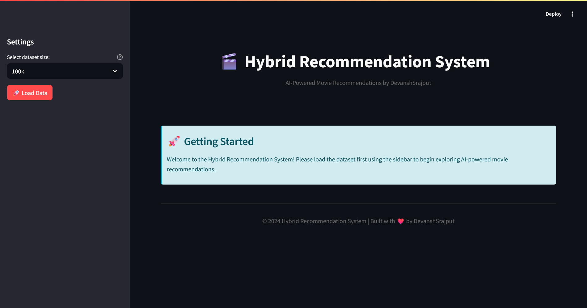
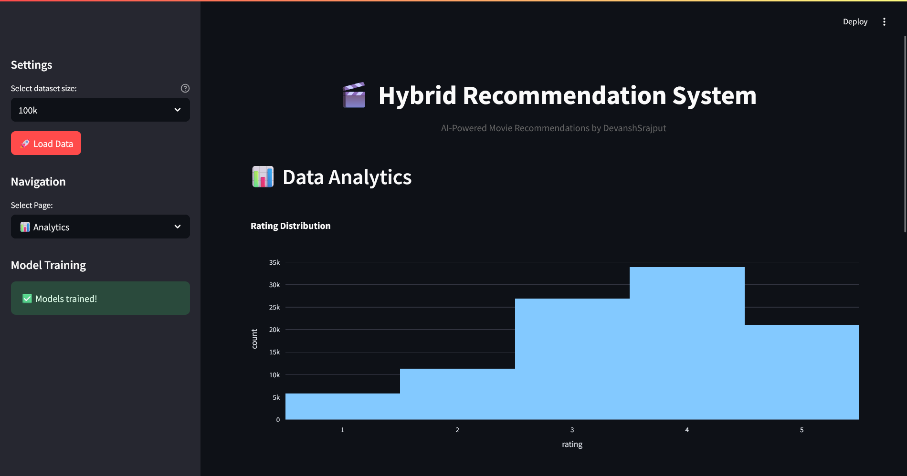
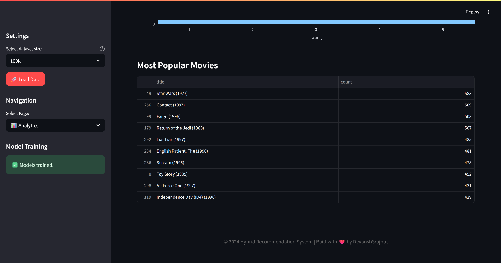
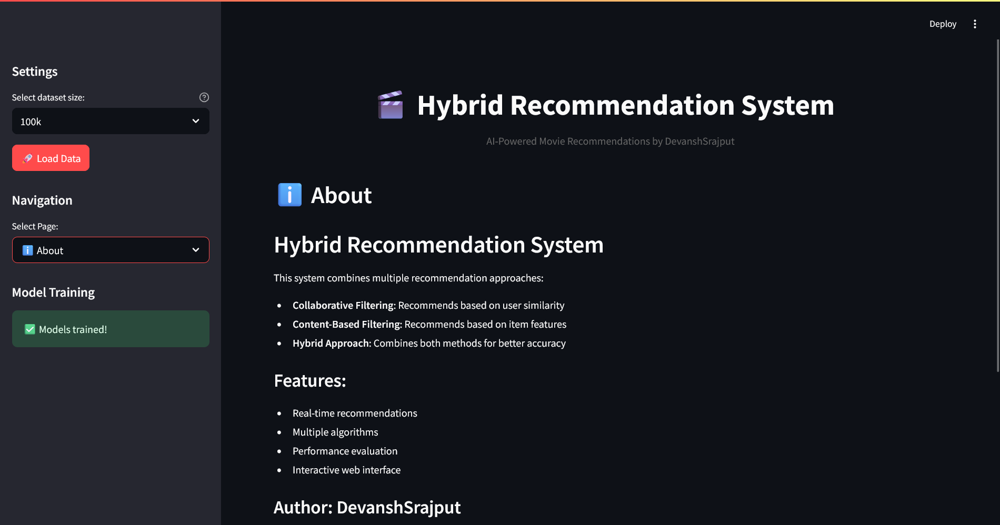

# 🎬 Hybrid Recommendation System

> _"Because Netflix isn't going to recommend itself..."_

---

## Table of Contents

- [About](#about)
- [Model Details](#model-details)
- [Dataset Used](#dataset-used)
- [Approach](#approach)
- [How to Run](#how-to-run)
- [Demo Screenshots / Video](#demo-screenshots--video)
- [Features](#features)
- [Contributing](#contributing)
- [License](#license)

---

## About

Welcome to the **Hybrid Recommendation System**!  
This project is a not-so-humble attempt to combine the best of collaborative and content-based filtering, because why settle for one when you can have both (and twice the bugs)?  
Built with Python, Streamlit, and a healthy dose of sarcasm.

---

## Model Details

- **Collaborative Filtering:**  
  Uses user-item interaction matrices to find users who are suspiciously similar to you (statistically, not emotionally).
  - Implemented with matrix factorization and nearest neighbors.
  - Handles cold start about as well as your average barista handles a complicated coffee order.

- **Content-Based Filtering:**  
  Recommends movies based on their features (genres, tags, etc.), because sometimes you just want more of the same.
  - Uses TF-IDF and cosine similarity.
  - Ignores your actual taste, but hey, at least it’s explainable.

- **Hybrid Model:**  
  Combines both approaches, so you get the worst of both worlds (just kidding, it’s actually pretty good).
  - Weighted blending of collaborative and content-based scores.
  - Tunable weights, because you love tweaking knobs.

---

## Dataset Used

- **MovieLens** (100k, 1M, or 10M, depending on how much RAM you want to sacrifice)
  - [GroupLens MovieLens Datasets](https://grouplens.org/datasets/movielens/)
  - Includes user ratings, movie metadata, and enough missing values to keep things interesting.

---

## Approach

1. **Data Preprocessing:**  
   - Download and clean MovieLens data.
   - Encode user and item IDs (because models don’t like strings).
   - Engineer content features (genres, tags, etc.).
   - Split into train/test, because we’re not savages.

2. **Model Training:**  
   - Train collaborative filtering model on user-item matrix.
   - Train content-based model on movie features.
   - Combine both in a hybrid model, because synergy.

3. **Evaluation:**  
   - Precision, recall, F1, NDCG, RMSE, coverage, diversity, novelty, and other metrics you’ll probably ignore.
   - Interactive analytics dashboard, so you can pretend to care about the numbers.

4. **Web Interface:**  
   - Built with Streamlit, because everyone loves sliders and buttons.
   - Real-time recommendations, analytics, and data exploration.
   - Sidebar navigation, because tabs are too mainstream.

---

## How to Run

1. **Clone this repo**  
   ```
   git clone https://github.com/DevanshSrajput/hybrid-recommendation-system.git
   cd hybrid-recommendation-system
   ```

2. **Install dependencies**  
   ```
   pip install -r requirements.txt
   ```

3. **Launch the web interface**  
   ```
   python main.py
   ```
   Or, if you’re feeling old-school:
   ```
   streamlit run src/web_interface.py
   ```

4. **Profit**  
   (Just kidding, this is open source.)

---

## Demo Screenshots / Video

> _"A picture is worth a thousand words, but a screenshot is worth at least a bug report."_

<div align="center">
<table>
<tr>
<td align="cemter"><br><b>🏡Home Dashboard</b></td>
<td align="cemter"><br><b>📤 Recommendation Page</b></td>
</tr>
<tr>
<td align="cemter"><br><b>📊 Recommendation Preview</b></td>
<td align="cemter"><br><b>💬 Analytics</b></td>
</tr>
<tr>
<td align="cemter"><br><b>🤖 Analytics Preview</b></td>
<td align="cemter"><br><b>📊 Explore Data</b></td>
</tr>
<tr>
<td align="cemter"><br><b>⚙️ Data Preview</b></td>
<td align="cemter"><br><b>About</b></td>
</tr>
</table>
</div>

- ## WalkThrough Video:
  

https://github.com/user-attachments/assets/16b1d57c-2ec8-4b80-b37d-045daa910e9b


---

## Features

- Hybrid recommendations (because two is better than one)
- Interactive Streamlit web UI
- Model evaluation and analytics
- Data exploration tools
- CLI mode for the terminally inclined
- Sarcastic comments (optional, but recommended)

---

## Contributing

Pull requests are welcome!  
If you find a bug, congratulations—you’re now a contributor.  
Open an issue or submit a PR.  
Just don’t break the build (seriously).

---

## License

MIT License.  
Because lawyers need jobs too.

---

**Made with ❤️ and a dash of cynicism by [DevanshSrajput](https://github.com/DevanshSrajput)**
